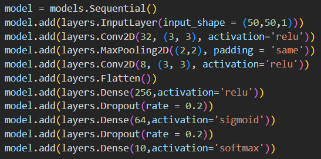
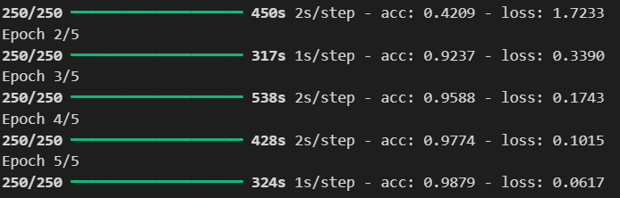
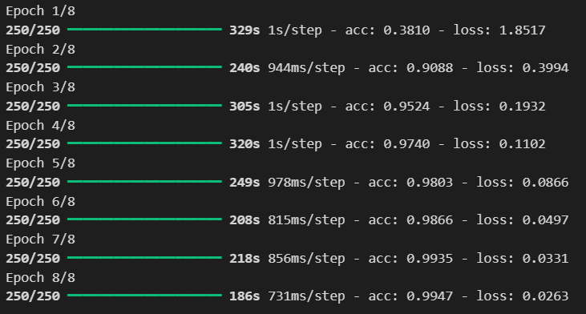
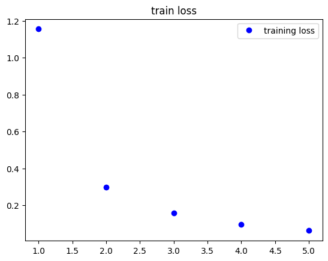
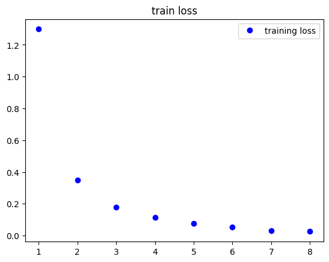
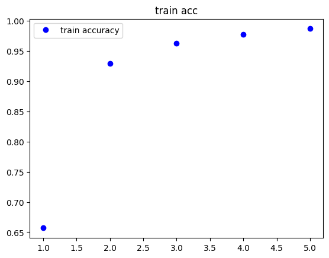
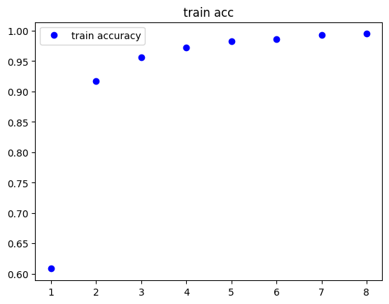
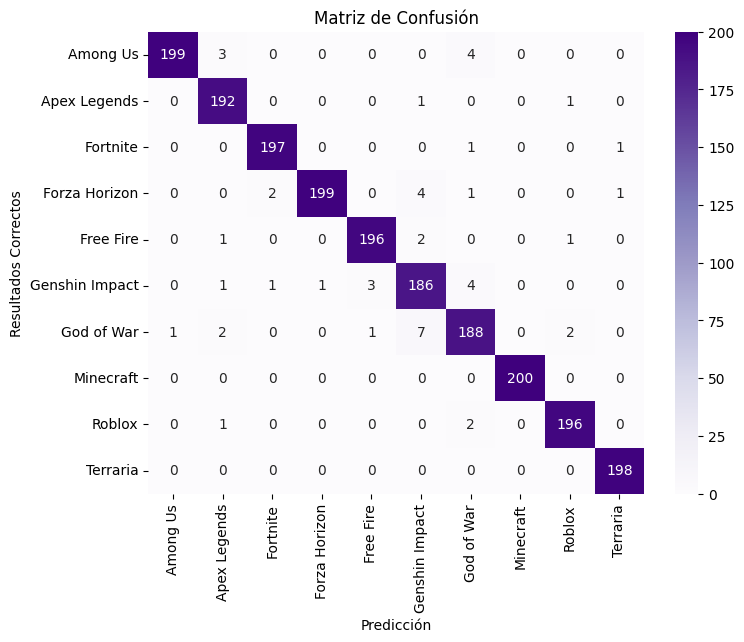

# TC3002B

## Actividad 2.1 y Actividad 2.2
### Generación o Selección del Set de Datos y Preprocesado de los datos 
Se obtuvo un dataset de la plataforma _Kaggle_ que contiene imagenes de diferentes videojuegos. Este dataset cuenta con 10 clases y se tiene alrededor de 1000 imágenes por clase.
Las clases son las siguientes:
* Terraria
* Roblox
* Minecraft
* God of War
* Genshin Impact
* Free Fire
* Forza Horizon
* Fortnite
* Apex Legends
* Among Us

Para realizar la separación de los sets de prueba y entrenamiento se uso el _script_ [*movetraintestfiles.py*](https://github.com/AdrenalChip/TC3002B/blob/main/movetraintestfiles.py) que mueve de una carpeta a otra las imagenes de manera aleatoria, respetando la relacion 80% - 20% por cada clase existente.
En el archivo [*preprocess_0.1.py*](https://github.com/AdrenalChip/TC3002B/blob/main/preprocess_0.1.py) carga las diferentes imágenes, tanto de entrenamiento como validación y normaliza los valores entre 0 y 1. 

Más información del dataset dentro del archivo [*gameplay_images.txt*](https://github.com/AdrenalChip/TC3002B/blob/main/gameplay_images.txt).   

## Actividad 2.3 y Actividad 2.4
### Implementación del Modelo y Evualación Inicial del Modelo

Se tomo como referencia lo presentando en el siguiente paper para la creación del modelo,y la creación de la matriz de confusión para analizar los resultados con el set de datos pertenecientes al test. Asi como ver la grafica que representa los valores de accuraccy y lost del modelo al ser entrenado

### Comparación de Modelos

| | Modelo Actual | Modelo Mejorado |
| -------------- | -------------- | -------- |
| Hiperparametros | batch size = 32, epoch = 5, optimizer = 'adam' | batch size = 32, epoch = 8, optimizer = 'adam'|
| Configuración de las capas |  |  |
| Progreso de las epocas |  |   |
| Gráficas de Loss |  |  |
| Gráficas de Accuraccy |  |  |
| Test Loss| 0.09448109567165375 | 0.08170373737812042 |
| Test Accuracy| 0.9750000238418579 | 0.9754999876022339 |
| Matriz de Confusión|  |  |

## Referencias y Enlaces de Interes

Ali, Aseel Sami, and MatheelEmaduldin Abdulmunem. "Image classification with Deep Convolutional Neural Network Using Tensorflow and Transfer of Learning." Journal of the College of Education for Women 31.2 (2020): 156-171.
[Link al Paper](https://www.iasj.net/iasj/download/7e648e76d9363337)

[Link al Drive de las Imágenes](https://drive.google.com/drive/folders/11SkaT7sGMPT6QlXJ7xYzSnjdPyowvUmV?usp=sharing)

[Link al Dataset de Kaggle](https://www.kaggle.com/datasets/aditmagotra/gameplay-images)

