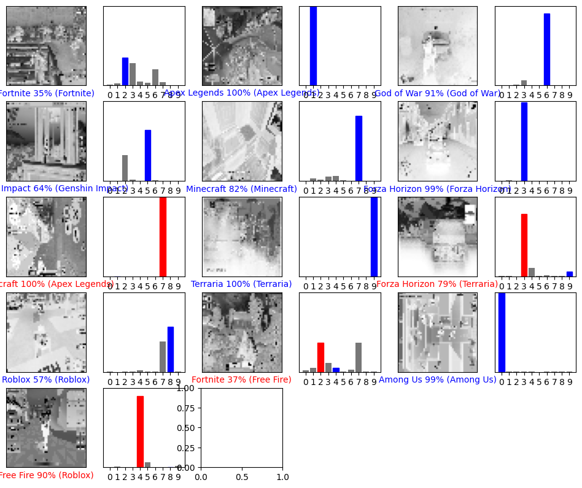

# TC3002B

En este repositorio se encuentra un clasificador de imágenes a través de una red convolucional realizada en lenguaje de _Python_ con la libreria de _Tensorflow_. 

## Dataset

Se obtuvo un dataset de la plataforma _Kaggle_ que contiene imagenes de diferentes videojuegos. Este dataset cuenta con 10 clases y se tiene alrededor de 1000 imágenes por clase.

Las clases son las siguientes:
* Terraria
* Roblox
* Minecraft
* God of War
* Genshin Impact
* Free Fire
* Forza Horizon
* Fortnite
* Apex Legends
* Among Us

Estas imágenes son proveninetes del _gameplay_ de cada uno de los juegos. Es decir son imagenes dentro del juego, no contienen imágenes de los diferentes menús presentes en cada uno de los videojuegos.

Más información del dataset dentro del archivo [*gameplay_images.txt*](https://github.com/AdrenalChip/TC3002B/blob/main/gameplay_images.txt). 

### Tratamiento Realizado

Lo primero que se realizo fue un _script_ [*movetraintestfiles.py*](https://github.com/AdrenalChip/TC3002B/blob/main/movetraintestfiles.py) para separar el dataset en _Train_ y _Test_ en una relacion 80% y 20%, a traves de una selección aleatoria de imagenes de cada una de las diferentes categorias.

Una vez teniendo las imágenes distribuidas de esta manera se procedio al tratado de las imágenes en donde se realizo la operación de _rescale_ para convertir el valor de cada uno de los pixeles de la imagen en un valor entre 0 y 1 para facilitar el procesamiento del modelo.  Cabe destacar que tambien se cambio la escala de color de RGB a una escala de grises, esto con el fin de que el modelo no aprenda la paleta de colores de los diferentes videojuegos y que busque aprender otros detalles, como los gráficos y la distribución del _HUD_.

## Modelo

El modelo realizado, toma de referencia 2 articulos encontrados que hablan sobre la clasificación de imágenes, estos articulos fueron seleccionados por una fácil comprensión y que aborda la clasificación de imágenes de manera similar a lo abordado en clases con un número superior a 5 clases a ser clasificadas. 
Es un modelo secuencial que esta formado por 10 capas:
* InputLayer: Capa que funciona como input del modelo
* Conv2D: Capa que permite la creación de diversos kernels para el procesamiento de pixeles
* MaxPooling2D: Una capa que permite reducir las dimensiones y tamaño de las imágenes al ser procesadas.
* Conv2D
* Flatten: Esta capa finaliza la conversión de datos de las imagenes almacenando en un vector de una sola dimensión aquellos valores de los diferentes pixeles / kernels que se encontraron
* Dense: La capa densa permite generar inputs y outputs dependiendo de la cantidad de nueronas que se manejan entre cada una de las capas. Y permite la conexión entre diversas capas. 
* Dropout: esta capa esta configurada para congelar el 20% de los nodos en este punto y solo dejando que pase el 80% de las nueronas en este punto, una técnica utilizada para evitar el _overfitting_
* Dense: esta capa cuenta con la función de activación _Sigmoid_ la cual es usada para obtener el output como una probabilidad, puesto que maneja unicamente valores entre 0 y 1. A diferencia de _ReLU_, esta gráfica se muestra en un curva para buscar el resultado más probable. 
* Dropout: esta capa esta configurada para congelar el 20% de los nodos en este punto y solo dejando que pase el 80% de las nueronas en este punto, una técnica utilizada para evitar el _overfitting_.
* Dense: Esta última capa cuenta con la función de activación _Softmax_ esto para sumar cada una de los valores presentados en los nodos y obtener valores entre 0 y 1 de cada una de las 10 posibles categorias, y en donde el número este más cerca de 1 significa que la imágen pertenece a esta categoria. 

Al ejecutar el modelo se establece un _categorical_crossentropy_, esto para definir que es una clasificación de más de 2 clases. El optimizador en esta caso es _adam_, el cual permite una adaptabilidad en el _learning rate_ conforme las épocas progresan, es un optimizador que no es demandante para la computadora mantiendo una eficiencia competitiva. Las métricas que se obtienen son _Loss_ (perdida) y _Acc_ (precisión) las cuales son graficadas como se muestra en la tabla debajo. Y este modelo es entrenado en 8 epocas en un tiempo aproximado de 30 minutos.

## Comparación de Modelos y Resultados

Los cambios realizados a la primera versión para ser mejorado consistio en aumentar el número de epocas con el fin de mejorar la predicción del modelo al recibir imágenes externas al dataset, esta cambio es el denominado modelo denominado como [*videogame_img_v3.h5*](https://github.com/AdrenalChip/TC3002B/blob/main/videogame_img_v3.h5)

Tambien se encuentra el modelo [*videogame_img_v2.h5*](https://github.com/AdrenalChip/TC3002B/blob/main/videogame_img_v2.h5) en el cual se redujeron el número de capas, dando la siguiente configuración:
* InputLayer
* Conv2D
* MaxPooling2D
* Conv2D
* Flatten
* Dense
* Dropout
* Dense
Este cambio logro reducir el tiempo de entrenamiento con un resultado similar en _acc_ y _lost_ , a las otras versiones. Sin embargo con esta configuración aumento el número de predicciones erróneas dentro de la matriz de confusión.

| | Modelo Actual | Modelo Mejorado |
| -------------- | -------------- | -------- |
| Hiperparametros | batch size = 32, epoch = 5, optimizer = 'adam' | batch size = 32, epoch = 8, optimizer = 'adam'|
| Configuración de las capas |  |  |
| Progreso de las epocas |  |   |
| Gráficas de Loss |  |  |
| Gráficas de Accuraccy |  |  |
| Test Loss| 0.09448109567165375 | 0.08170373737812042 |
| Test Accuracy| 0.9750000238418579 | 0.9754999876022339 |
| Matriz de Confusión|  |  |

Utilizando el modelo mejorado se realizo la prueba con imágenes externas al dataset para evaluar si podria predecir cualquier imágen y clasificarla dentro de alguna de sus categorias. El resultado obtenido se muestra a continuación, en donde el nombre en parentesis era el resultado esperado, un color rojo indica un error de predicción y azul un resultado acertado.

## Resultados y Conclusión

El resultado se puede interpretar de la siguiente manera: Al intentar predecir con imágenes externas, el tamaño de las mismas son diferentes a las entrenadas y al ser rescaladas o pasar por las capas de _Conv2D_, se pierden puntos claves como partes del _HUD_ y otros indicadores que el modelo aprendio de su dataset. Tambien la posición de los personajes en la imágen parece afectar puesto que no se contemplaba previamente posibles cambios en la camara a nivel de renderizado dentro de cada posible juego. Para lograr un resultado optimo se recomienda trabajar con imágenes con la misma resolución para evitar perder datos importantes. 

Este proyecto fue mi primer acercamiento con el área de Inteligencia Artifical en el cuál descubri algunos de los elementos involucrados, desde la obtención de un dataset y la importancia de tratar dichos datos para simplificar y reducir errores una vez se proceda a las siguentes etapas. Lo que más destaco de esta actividad es el buscar comprender las razones de las decisiones tomadas dentro del desarrollo y configuración del modelo y saber que hacer con los resultados para buscar una mejora o tratar de buscar una solución, dependiendo del caso. El marco téorico de esta área de la computación me parecio muy interesante sabiendo la involucración tan cercana que tiene con las mátematicas e interpretación y raciociono de datos para lograr la toma de decisiones automatizada. 

## Referencias y Enlaces de Interes

Ali, Aseel Sami, and MatheelEmaduldin Abdulmunem. "Image classification with Deep Convolutional Neural Network Using Tensorflow and Transfer of Learning." Journal of the College of Education for Women 31.2 (2020): 156-171.
[Link al Paper](https://www.iasj.net/iasj/download/7e648e76d9363337)

Abu, M. A., Indra, N. H., Rahman, A. H. A., Sapiee, N. A., & Ahmad, I. (2019). A study on Image Classification based on Deep Learning and Tensorflow. International Journal of Engineering Research and Technology, 12(4), 563-569.[Link al Paper](https://www.researchgate.net/profile/Mohd-Azlan-Abu/publication/332850035_A_study_on_Image_Classification_based_on_Deep_Learning_and_Tensorflow/links/5cccd2dfa6fdccc9dd8b3e69/A-study-on-Image-Classification-based-on-Deep-Learning-and-Tensorflow.pdf)

[Link al Drive de las Imágenes](https://drive.google.com/drive/folders/11SkaT7sGMPT6QlXJ7xYzSnjdPyowvUmV?usp=sharing)

[Link al Dataset de Kaggle](https://www.kaggle.com/datasets/aditmagotra/gameplay-images)

